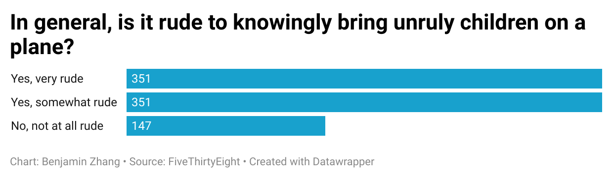

# Flying-Etiquette

I chose the question of whether it is rude to knowingly bring unruly children on a plane because I've had personal experiences with unruly children on airplanes, and they were not pleasant. Therefore, I wanted to know how the general public felt about the topic. 

The chart revealed that the majority of people found bringing unruly children on a plane rude, with a good percentage even going as far as to say that it's very rude. 

I found one more interesting thing when I was playing around with the raw data. I wondered what the public perception of bringing a baby on a plane was. It turns out, almost all of the people found bringing babies on a plane as not rude. It seems that the public is much more tolerant with babies than with older children. 
